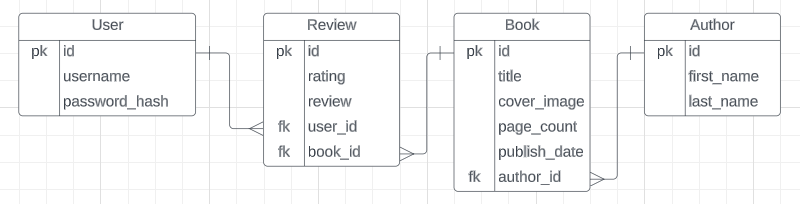

# CosmicCritic 🛸

CosmicCritic is a React Flask web application utilizing Material UI for rating and reviewing science fiction books. Users can browse through the list of books, view details on the books, and see other user's ratings and reviews. Upon signing up for an account, the user can leave their own ratings and reviews on the books. The user has the ability to edit or delete these reviews, as well as view statistics, like the average of their ratings and the number of reviews they have left.

## Installation

1. Fork and clone this repository
2. Navigate to the local directory with

   `cd cosmiccritic`

3. You will need to create a `.env` file in order to store the application's secret key.

   1. This can be done within the command line with the command `touch .env` while you're in the local directory.
   2. Next, run the command `python -c 'import os; print(os.urandom(16))'` to generate your secret key. Copy the output of this command.
   3. Open your `.env` file and set a variable called `APP_SECRET_KEY` to your generated secret key in the form of `APP_SECRET_KEY=your_secret_key_here`

4. Install required libraries and enter the virtual environment for the backend from the Pipfile with:

   ```
   cd server

   pipenv install && pipenv shell

   ```

5. Seed the database with test data by running:

   ```
   python seed.py
   ```

6. Start the backend application by running within the server directory:

   ```
   python app.py
   ```

   Make sure the server is up and running by navigating to `http://localhost:5555` in your browser.

7. Navigate back to the root directory, then into the client directory, and install frontend dependencies with:

   ```
     cd ..

     cd client

     npm install
   ```

8. Start the frontend application by running within the client directory:

   ```
   npm start
   ```

   Make sure the application is up and running by navigating to `http://localhost:3000` in your browser.

## Entity Relationships



## Roadmap

- [ ] Separate seed.py into distinct files such as book_seed.py and user_seed.py so that the database can be seeded with books without seeding users and reviews.
- [ ] Implement likes and comments on reviews.
- [ ] Research if there's an API available to pull in book data. As it stands, new books need to be manually added to the `seed.py` file.
- [ ] Update review model to include created_at and updated_at data.

## Contributions

Contributions are welcome! Please fork the repository and create a new branch for your features or bug fixes. Submit a pull request describing your changes.

## License

This project is licensed under the [MIT License](https://choosealicense.com/licenses/mit/).

## Acknowledgments

Book cover images sourced for demonstration purposes from [GoodReads](https://www.goodreads.com/)

UI implemented with [Material UI](https://mui.com/)

Fuzzy search implemented with [Fuse.js](https://www.fusejs.io/)
